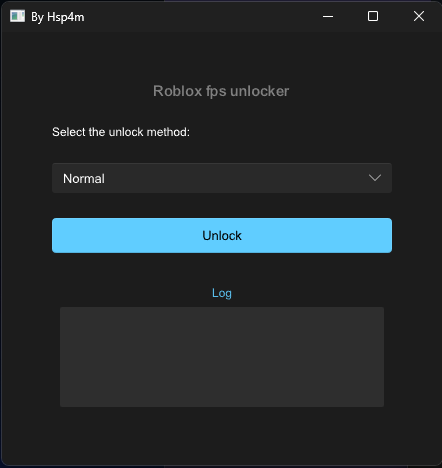

# Roblox Fps Unlock using Rust



## Getting started:

### Normal use

#### Download the latest release
> [Download here](https://github.com/HSp4m/roblox-fps-unlocker/releases/latest/download/roblox-fps-unlocker.exe)


###### Now just run the 'Roblox-fps-unlocker.exe' and unlock your fps :)

### Development

#### Clone the repository
```Bash
git clone https://github.com/HSp4m/react-beginner-projects
```

#### Navigate to the app directory
```Bash
cd roblox-fps-unlocker
```
#### Run with cargo
```Bash
cargo run
```

###### Done :)